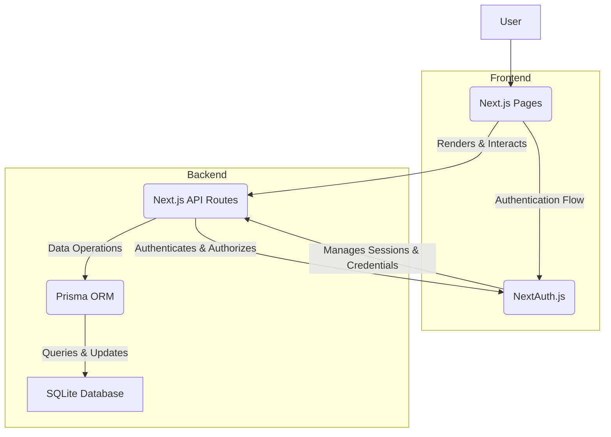

# Carthus - Project Guide: Elijeweb

## 1. Project Overview

Elijeweb is a full-stack Next.js application designed to function as an AI sales assistant for businesses operating on Meta platforms. Its primary purpose is to automate sales processes and provide comprehensive tools for managing orders, tracking stock, and analyzing business performance. The application leverages modern web technologies to deliver a robust, scalable, and user-friendly solution for businesses looking to streamline their operations on social media platforms.

## 2. Key Technologies & Dependencies

The project is built upon a modern JavaScript ecosystem stack, utilizing the following core technologies:

*   **Language**: TypeScript
*   **Framework**: Next.js (App Router)
*   **Styling**: Tailwind CSS
*   **Database ORM**: Prisma
*   **Database**: SQLite (for development, file-based)
*   **Authentication**: NextAuth.js
*   **Runtime**: Node.js (v18 or higher)
*   **Package Manager**: npm or yarn
*   **Version Control**: Git

## 3. File Structure Analysis

The project follows a standard Next.js App Router structure, promoting clear separation of concerns and maintainability:

*   **`app/`**: This is the core directory for the Next.js App Router. It contains all page-level components, layouts, and API routes.
    *   **`app/api/`**: Houses all Next.js API routes, serving as the backend endpoints for authentication (`auth/[...nextauth]/route.ts`), order management (`orders/route.ts`, `orders/[orderId]/route.ts`), product management (`products/route.ts`), and user registration (`register/route.ts`).
    *   **`app/dashboard/`**: Contains the protected dashboard page (`page.tsx`) where authenticated users can manage their sales and analytics.
    *   **`app/login/`, `app/register/`, `app/reset-password/`**: Dedicated directories for authentication-related user interface pages.
    *   **`app/globals.css`**: Defines global styles for the application, primarily utilizing Tailwind CSS directives.
    *   **`app/layout.tsx`**: The root layout component that wraps the entire application, providing a consistent structure.
    *   **`app/page.tsx`**: The main homepage or landing page of the application.
*   **`components/`**: This directory is dedicated to reusable React components.
    *   **`components/ui/`**: Contains generic, atomic UI components (e.g., `Button.tsx`, `Input.tsx`) that can be used across different parts of the application, promoting consistency and reusability.
*   **`prisma/`**: (Inferred) This directory typically contains the `schema.prisma` file, which defines the database schema, models, and relationships used by Prisma ORM.
*   **`.env` / `.env.example`**: Configuration files for environment-specific variables, such as database connection strings (`DATABASE_URL`), authentication secrets (`NEXTAUTH_SECRET`), and application URLs (`NEXTAUTH_URL`).

## 4. Setup & Build Instructions

To set up and run the Elijeweb project locally, follow these steps:

1.  **Prerequisites**: Ensure you have Node.js (v18 or higher), npm/yarn, and Git installed on your system.
2.  **Clone the Repository**:
    ```bash
    git clone https://github.com/your-username/elijeweb.git
    cd elijeweb
    ```
3.  **Install Dependencies**:
    ```bash
    npm install
    # or
    yarn install
    ```
4.  **Environment Variables**: Create a `.env` file in the project root based on `.env.example`. Populate it with the necessary values:
    ```dotenv
    DATABASE_URL="file:./dev.db"
    NEXTAUTH_SECRET="YOUR_NEXTAUTH_SECRET" # Generate a strong, random string (e.g., openssl rand -base64 32)
    NEXTAUTH_URL="http://localhost:3000"
    ```
5.  **Set up the Database**: This project uses Prisma with SQLite. Run migrations to create the database schema:
    ```bash
    npx prisma migrate dev --name init
    ```
    This command will create the `dev.db` file and apply the schema defined in `prisma/schema.prisma`.
6.  **Run the Development Server**:
    ```bash
    npm run dev
    # or
    yarn dev
    ```
7.  **Access the Application**: Open your browser and navigate to `http://localhost:3000`.

## 5. Proposed CI/CD Pipeline

A simple CI/CD pipeline, ideally implemented using GitHub Actions, would ensure code quality, test coverage, and successful builds for the Elijeweb project.

**Workflow Steps:**

1.  **Trigger**: The pipeline should be triggered on `push` events to the `main` branch and on `pull_request` events targeting the `main` branch.
2.  **Environment Setup**:
    *   Checkout the repository.
    *   Set up Node.js (v18) and cache npm dependencies.
    *   Install project dependencies (`npm install`).
3.  **Quality Checks**:
    *   **Linting**: Run `npm run lint` (assuming a linting script is configured) to enforce code style and catch potential errors.
    *   **Testing**: Run `npm run test` (assuming unit/integration tests are implemented) to verify functionality and prevent regressions.
4.  **Build**:
    *   **Build Project**: Execute `npm run build` to compile the Next.js application for production. This step ensures that the application can be successfully built with the current codebase.
5.  **Deployment (Optional/Placeholder)**:
    *   After a successful build on the `main` branch, a subsequent step could handle deployment to a hosting provider (e.g., Vercel, Netlify, or a custom server). This step would typically involve environment-specific configurations and secrets.

## 6. Architecture Diagram



## 7. Potential Improvements

1.  **Comprehensive Testing Strategy**: Implement a robust testing suite including unit tests (e.g., Jest, React Testing Library for components), integration tests (for API routes and database interactions), and end-to-end tests (e.g., Playwright or Cypress for user flows). This will significantly improve code reliability, reduce bugs, and facilitate future refactoring.
2.  **Production Database Migration**: While SQLite is excellent for local development, it is not suitable for production environments due to limitations in concurrency, scalability, and robustness. Migrate to a production-grade relational database like PostgreSQL or MySQL, which can handle higher loads and provide better data integrity and backup capabilities.
3.  **Enhanced Error Handling and Logging**: Implement a centralized error handling mechanism across the application (both frontend and backend) and integrate a robust logging solution (e.g., Winston, Pino, or a service like Sentry/LogRocket). This will enable proactive monitoring, faster debugging, and better insights into application health and user experience.